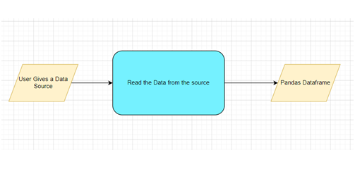

# User Guide
- Set up
- Installation steps
- Tutorial to demonstrate the installation process 
- 		```
		pip install autoneuro
		```
- To read and load data from various 
	 <div align="center"></div>
	- explanation
- To enable reading various file formats 
	- Screenshots
	- explanation
- To specify feature and target columns.
	- Screenshots
	- explanation
- to select the problem type, viz. Regression, Classification 
	- Screenshots
	- explanation
- to perform statistical analytics of the data 
	- Screenshots
	- explanation
- to perform graphical analysis for the data 
	- Screenshots
	- explanation
- to Perform data cleaning operation 
	- Screenshots
	- explanation
- to choose training model 
	- Screenshots
	- explanation
- Perform model Tuning.
	- Screenshots
	- explanation
